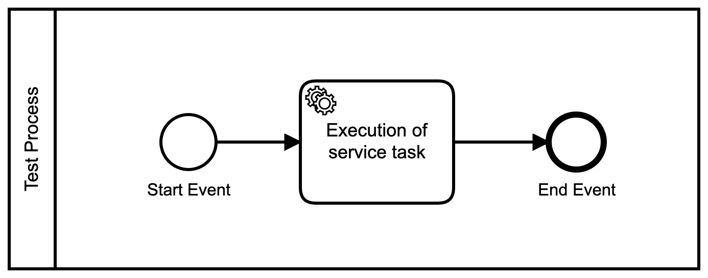

# Demo: Testing on Camunda Cloud 
This repository contains an example about how you can test BPMN processes for Camunda Cloud. 
To achieve this we have used the [Camunda Cloud Testing Project](https://github.com/camunda-cloud/camunda-cloud-testing). 

This dependency is valid for Java 11 or higher. To make use of it you can add the following dependency to your pom file. 
```
<dependency>
  <groupId>io.camunda</groupId>
  <artifactId>zeebe-bpmn-assert</artifactId>
  <version> </version>
  <scope>test</scope>
</dependency>
```

The [DemoApplicationTests](./src/test/java/camunda/cloud/testing/demo/DemoApplicationTests.java) class contains all important tests. 
There you can see: 
- How to test whether the Deployment succeeds 
- Check if a process instance has started successfully
- Verify if a job can be completed as expected 
- Find out if the process has terminated successfully

For the seek of simplicity we have chosen to use a very simple process model for the first draft of this example. You can find it below:
